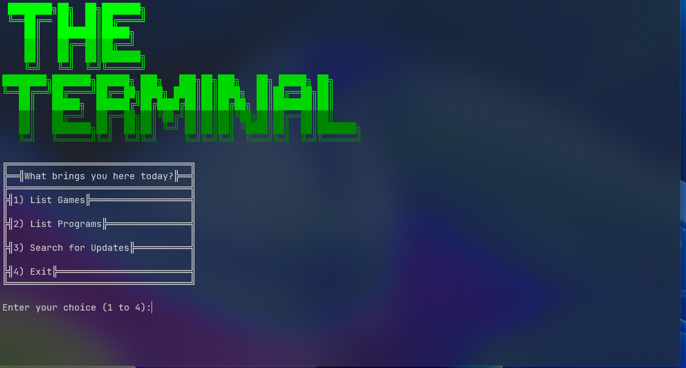

<h1 align="center">The Terminal╗  
╚══██╔══╝  
   ██║    
   ██║    
   ██║    
   ╚═╝    

  

  

 

A launcher for all applications I've created or bundled and include many games and apps. It's just something I like to work on in my spare time, but doesn't mean I'll fully abandon it! Again this is just a simple program for fun. All the menus and most apps are in Batch and compiled into an exe. So try it out!   

  

  
  
  
  
  
> The Fine Print: Some Applications are not made by HackiTech or tasqlab.
WINDOWS ONLY (Windows 8 and older required an extended kernel INSTALLED AND ENABLED)
To get Full Colour working on older versions, install ansicon and load the version that matches your architecture, then in the new window type "ansicon -i"
You should have colour working, for compatability and other fixes, read below.

Known Issues
Windows 7:
Issue: "The system cannot write to the specified device" showing across the screen over and over.
Fix: Set your console font to Consolas and download AND ENABLE AnsiCon

General Bugs
Issue: Apps don't run or display errors about missing *.dll files.
Fix: Make sure you have the Microsoft Visual C++ Redistributable 2015-2022

Thanks!

<samp>
<pre>
______  __            ______ ____________           ______  
___  / / /_____ _________  /_____  _/_  /______________  /_ 
__  /_/ /_  __ `/  ___/_  //_/__  / _  __/  _ \  ___/_  __ \
_  __  / / /_/ // /__ _  ,<  __/ /  / /_ /  __/ /__ _  / / /
/_/ /_/  \__,_/ \___/ /_/|_| /___/  \__/ \___/\___/ /_/ /_/ 
                                                            
</pre>
</samp>
